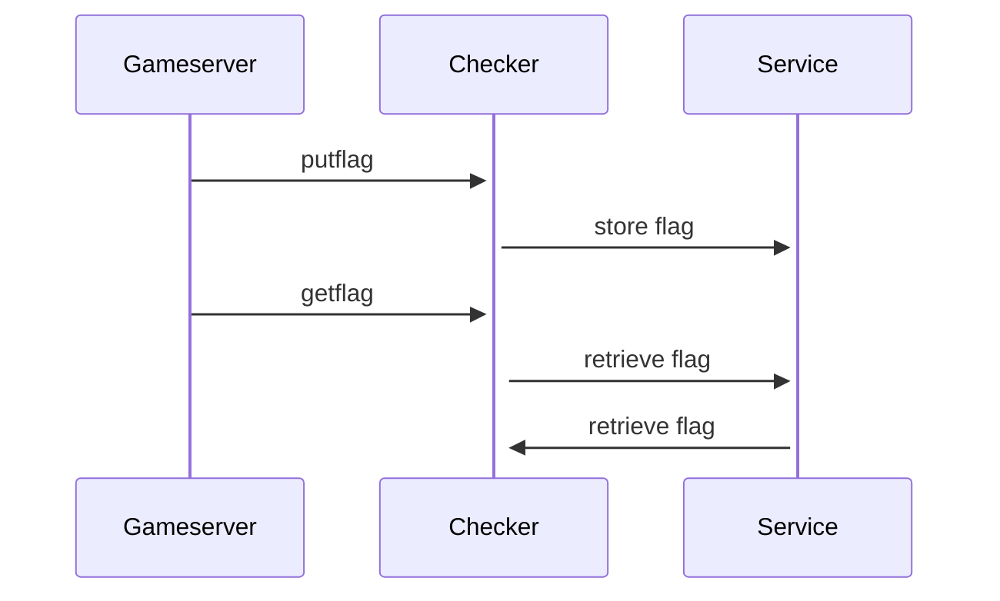
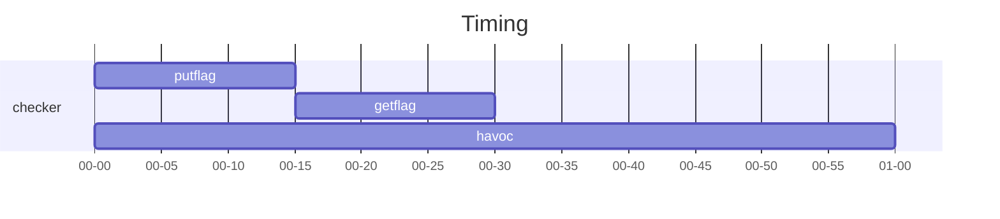

# One Round

# Basic requests

```mermaid
sequenceDiagram
    Gameserver->>+Checker: putflag
    Checker->>+Service: store flag
    Gameserver->>+Checker: getflag
    Checker->>+Service: retrieve flag
    Service->>+Checker: retrieve flag
            
```

# Timing

```mermaid

gantt
    title Timing
    dateFormat  mm-ss
    axisFormat  %M-%S
    section checker
    putflag         :a1, 00-00, 15s
    getflag         :after a1  , 15s            
    havoc           :a2, 00-00, 60s
```