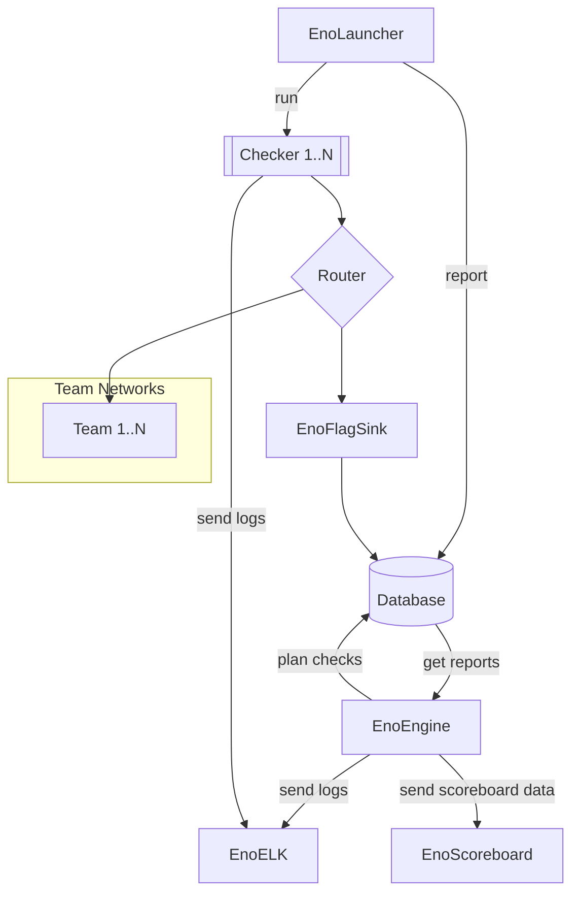

# Welcome to Enowars

Enowars is a Framework for running A/D CTF events.

## Overview

It's complex:

Now that you've seen this beautiful 😁 chart everything should be clear. For everyone else see below.

### Infrastructure

Click here to get up and running with the underlying [OS and Network stuff](infrastructure/infrastructure.md).

If you are the software guy/girl have a look at the [engine](infrastructure/engine.md).

### Services and Checkers

If you want to program your own service and submit it to us have a look at our [Create a service Guide](service/getting-started.md).

> Previous [Services](https://github.com/enowars?q=enowars) can be found on our [Github Page](https://github.com/enowars?q=enowars)

### Miscellaneous

To support everything we have an army of rogue shell and python scripts, as well as Libraries for testing. 

[EnoChecker](https://github.com/enowars/enochecker)

> TBD: [Specification](https://github.com/enowars/specification)

--8<-- "includes/abbreviations.md"