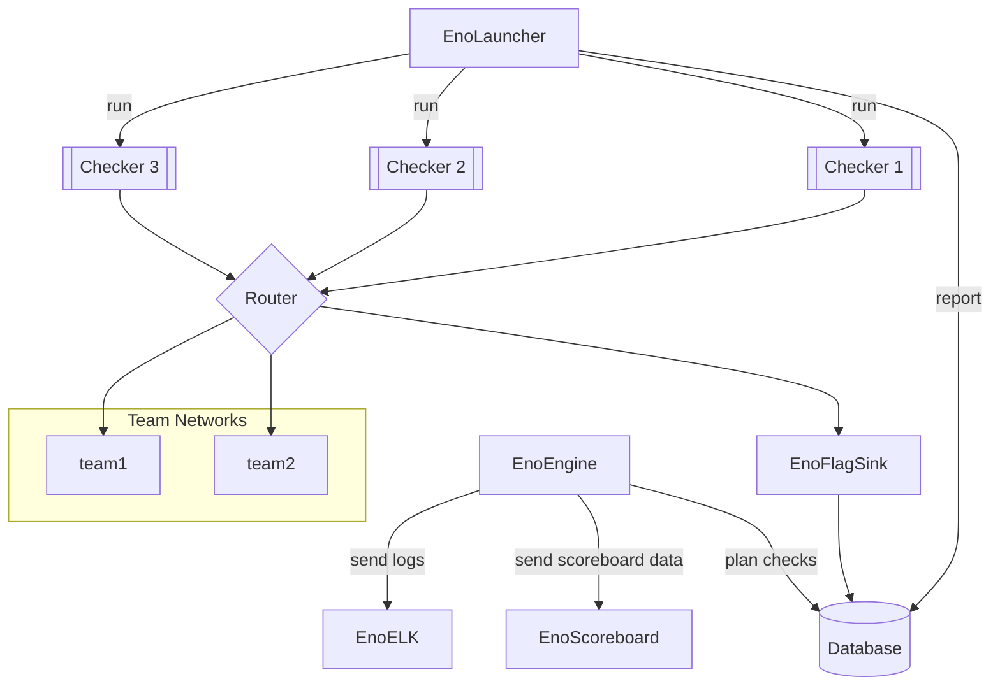

# Welcome to Enowars

Enowars is an Engine for running A/D CTF events.

## Overview

[Specification](https://github.com/enowars/specification)

[Engine](https://github.com/enowars/EnoEngine)
Consists of EnoELK, EnoEngine, EnoLauncher

Eno ELK consists of
Elasticsearch (search engine, noSQL)

- Logstash (ingest and transform data)
- Kibana (webfrontend)

Eno Moloch

[ScoreBoard](https://github.com/enowars/EnoLandingPage)

[Services](https://github.com/enowars?q=enowars)

[EnoChecker](https://github.com/enowars/enochecker)

--8<-- "includes/abbreviations.md"