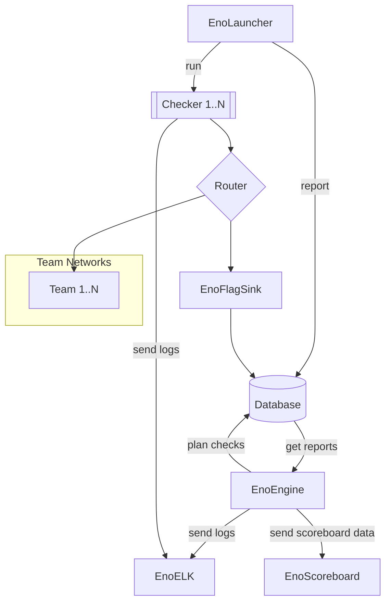

# Welcome to Enowars

Enowars is a Framework for running A/D CTF events.

## Overview

### Infrastructure

Everything is running in the cloud thats why we have s
### Services and Checkers

> Previous [Services](https://github.com/enowars?q=enowars) can be found on our [Github Page](https://github.com/enowars?q=enowars)

To develop a new one follow our [guide](service/getting-started.md). 

[EnoChecker](https://github.com/enowars/enochecker)

> TBD: [Specification](https://github.com/enowars/specification)

--8<-- "includes/abbreviations.md"