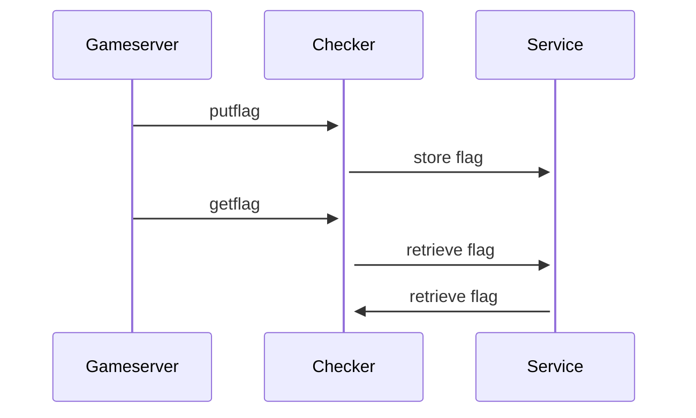
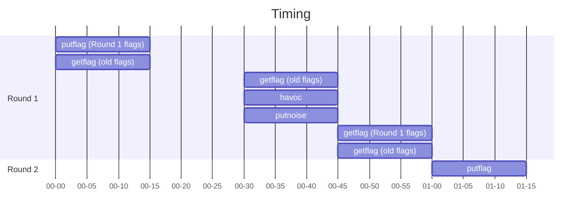

# Inner Workings

In order to store flags to capture and check whether a teams service is still running nominally the Engine dispatches several requests in each round.

## Request Types

| Request    | Purpose                                     |
| :--------- | :------------------------------------------ |
| `putflag`  | Inserts the flag into the service           |
| `getflag`  | Retrieves the flag from the service         |
| `havoc`    | Checks the service functionality            |
| `putnoise` | Insert other (public) data into the service |
| `getnoise` | Check other (public) data                   |

## Basic requests

## Timing

One round generally lasts 60 seconds. It is divided into 4 quarters, which each last 15 seconds.
The checker tasks are called in the depicted way:

> TODO: Are those scheduled right (the slides differ)?

