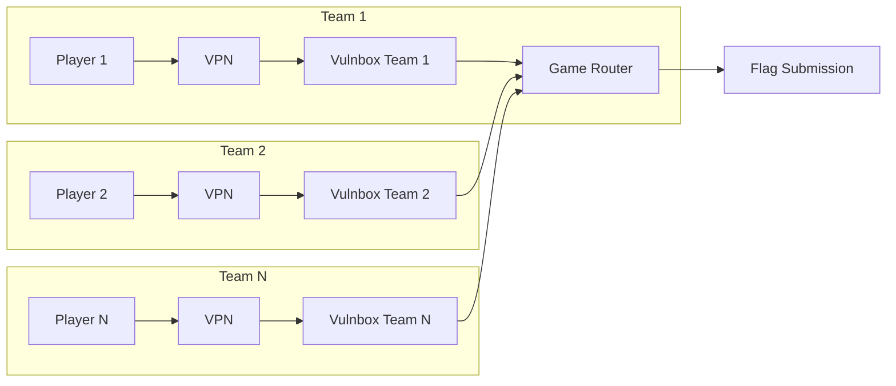

# Playing a CTF

## Network

```mermaid
graph LR
    gamerouter[Game Router] --> flagsubmission[Flag Submission]

    subgraph team1[Team 1]
    vuln1[Vulnbox Team 1] --> gamerouter
    player1[Player 1]--> vpn1[VPN]
    vpn1 --> vuln1
    end

    subgraph team2[Team 2]
    vuln2[Vulnbox Team 2] --> gamerouter
    player2[Player 2]--> vpn2[VPN]
    vpn2 --> vuln2
    end


    subgraph teamN[Team N]
        vulnN[Vulnbox Team N] --> gamerouter
        playerN[Player N]--> vpnN[VPN]
        vpnN --> vulnN
    end


```