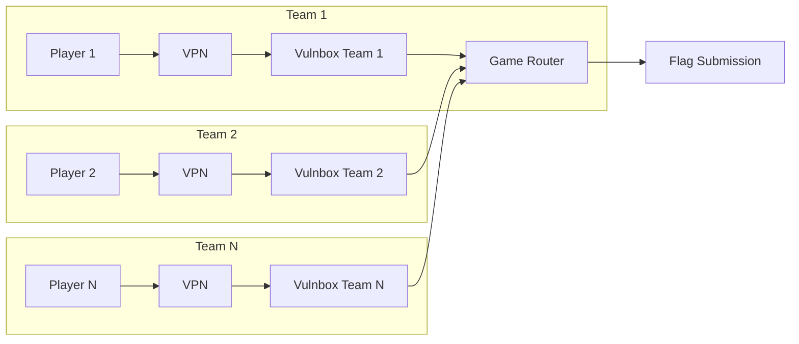

# Playing a CTF

## General

A typical attack/defense CTF consists of three components.

### The Gameserver

It is provided by the organizers and runs throughout the competition, starting when the network is opened. It periodically stores flags on your Vulnbox using functionality in the provided services. It then later retrieves these flags, again using existing functionality. The Gameserver <b>does not</b> run exploits! It simply uses the service as intended.
Now, why can't the other teams then simply do what the Gameserver does?
The Gameserver has more information. Every service is either designed to allow the Gameserver to store a specific token for each flag or generates one and returns it to the Gameserver.
The Gameserver uses this token to check periodically that the flag is still there. Whether or not it gets the stored flag using that token, determines your SLA (Service Level Agreement). You mustn't remove or break any legitimate functionality.
Some services can have a vulnerability that directly leaks the flag, which will let you retrieve the flag easily. For others, it will require more effort.

### Your Vulnbox

The Vulnbox is your running instance of the virtual machine image given to you by the organizers. It contains and runs all the services of the competition and should be reachable at all times. The Gameserver stores its flags here and uses the communication with this machine to decide if your services are working as intended or not. This machine is accessible to everyone on the network, and is the target for all the exploits from other teams.
Protecting the flags on this machine is what determines your defense points!
You normally have one hour from getting access to your Vulnbox until the network between teams is opened and everyone can attack each other. Use this time to get the VM running, then start analyzing what's running on it. It has happened that services with vulnerabilities that are easy to find have been exploited as soon as the actual competition starts.
For the Bambi CTF, we will be providing hosted vulnboxes which are accessible via SSH.

### The other teams

All the other registered teams are connected to the same VPN as you. Their Vulnboxes have known IP addresses, all other machines are off-limits! The other teams will run exploits from their own machines, but the VPN infrastructure will use NAT to obfuscate whether a packet came from the Gameserver or another team.
Successfully stealing and submitting flags from the Vulnbox of other teams determines your attack score!
If you have played jeopardy CTFs before, you already know flag submission. In this game however, you'll have to run you exploits periodically, as new flags get stored by the Gameserver every few minutes. So you probably want to script exploits and submit Flags automatically and you don't spend all your time manually exploiting everyone.

> Adapted from [FAUST CTF](https://2020.faustctf.net/information/attackdefense-for-beginners/)

## Network

<h3>Summary</h3>
<ul>
    <li>Game Network: <code>10.0.0.0/16</code></li>
    <li>Team Vulnbox: <code>10.0.0.{TeamId}/32</code></li>
    <li>Game Router: <code>10.0.1.1</code></li>
    <li>Flag Submission: <code>10.0.13.37:1337</code></li>
</ul>

To access your vulnbox, you must first start it. This will only be possible once the competition has started. **Note that you must check in before the competition starts, otherwise you will not be able to start your vulnbox**.

> Please refer to the [rules page](rules.md) for more information.

After the vulnbox is started, you will be shown your public vulnbox IP address and the root password which you can use to login. You will also be able to download an OpenVPN configuration file only after the vulnbox is started. See the section below for more details.

During the first hour of the CTF, the game network will be closed. This means you will not be able to reach the vulnboxes of other teams through the competition network. To check that your vulnbox and OpenVPN client is working as intended, you can try pinging `10.0.1.1`, which is the game router and should also be reachable even while the game network is closed.

The router performs SNAT on all game traffic, so all incoming traffic appears to be coming from `10.0.1.1`, regardless of whether it is coming from the game engine or other teams.

The `10.0.240.0/24` subnet for the team VPN is identical for all teams. These networks are completely separated from each other and you will not be able to access the devices in the VPN of other teams.

You can get a newline-separated list of all (confirmed) vulnbox addresses at the game portal

## OpenVPN Access for Players

We will provide an OpenVPN server through which you can access your vulnbox and the vulnboxes of the other teams (the latter only once the network has been opened).
To get seamless access to the game network, install the OpenVPN client for your operating system, and download the client configuration file that will be provided in the enowars portal. The config file will only be available once your have started your vulnbox. Note that the vulnbox serves as OpenVPN server for your team, so you will only be able to access the game network while your own vulnbox is running. The OpenVPN config file can be shared by all members of your team and allows multiple connections at once.
Please consult a search engine of your choice or the OpenVPN documentation for help getting started with OpenVPN.
